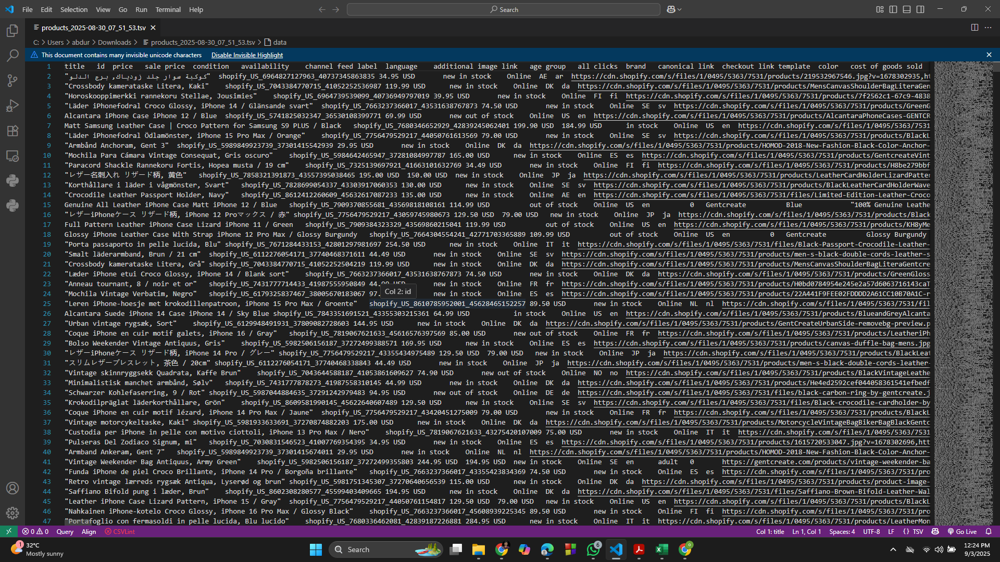
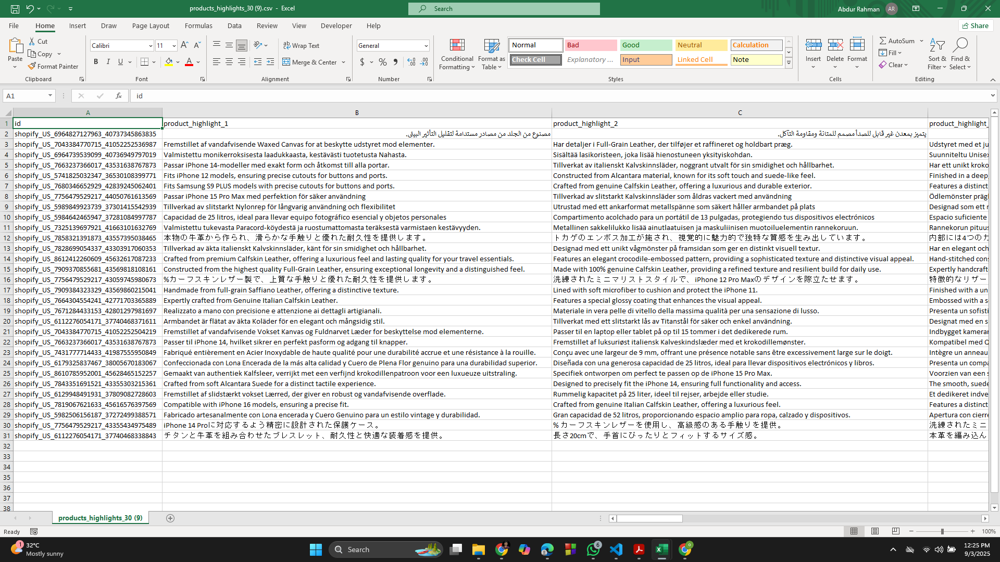
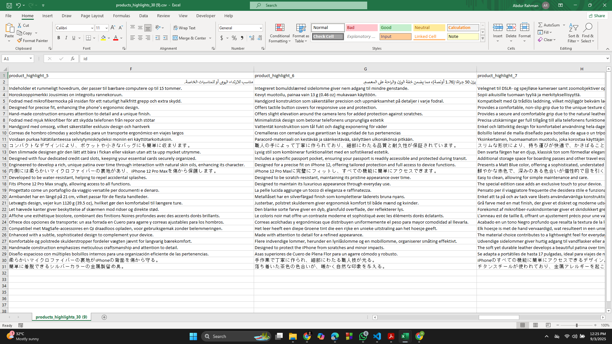

# GMC Product Highlights Generator

A Python + Gemini 2.5 Flash pipeline for generating **Google Merchant Center (GMC)-compliant product highlights**.  

This tool:
- Cleans messy product CSV/TSV data  
- Detects language from input automatically  
- Uses Gemini 2.5 Flash API to generate **10 unique, human-like highlights per product**  
- Outputs a ready-to-upload CSV for GMC  

---

## 🚀 Features
- **Multi-language support**: Generates highlights in the same language as the input (`en`, `sv`, `ar`, etc.)  
- **Data cleaning**: Handles missing, duplicate, or fragmented product descriptions  
- **Contextual weight and color highlights**: Weight is linked to comfort/travel, color with undertones/patina/gloss  
- **No fluff**: Factual, variant-specific, and compliant with Google’s best practices  
- **Batch processing**: Scales to thousands of products by chunking input files  

---
## 📸 Screenshots

### Input tSV file

### output part 1

### output part 2

